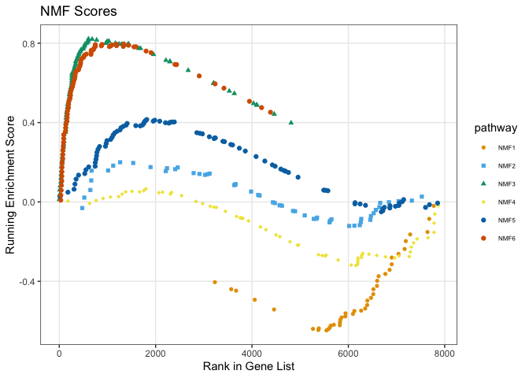
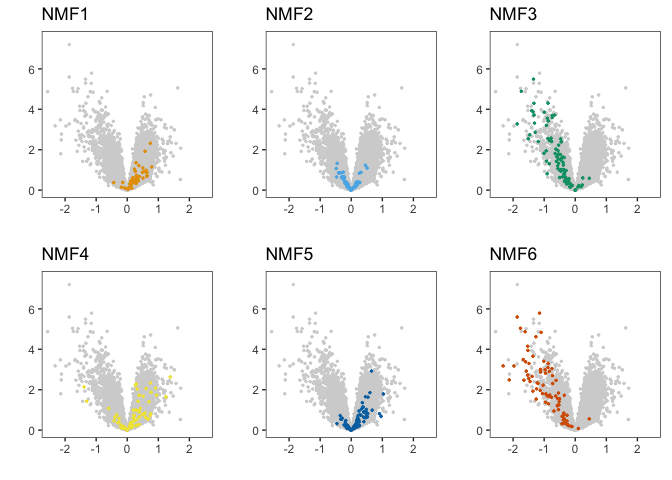

Pediatric_COVID_MISC_Neutrophils
================
Tom LaSalle

This document contains all the code necessary to generate the plots for
all figures pertaining to neutrophil RNA-seq data (Figure 2, Figure 3,
Supplementary Figure S1, Supplementary Figure S2, Supplementary Figure
S3). Plots are subsequently edited in Adobe Illustrator to produce the
final figures.

Load the necessary libraries:

Set the color palette:

``` r
well <- "#008300"
covid <- "#007fc7"
misc <- "#d00022"
vermillion <- rgb(213,94,0,max=255) 
bluishgreen <- rgb(0,158,115,max=255)
yellow <- rgb(240,228,66,max=255)
blue <- rgb(0,114,178,max=255)
orange <- rgb(230,159,0,max=255)
skyblue <- rgb(86,180,233,max=255)
lightgray <- rgb(211,211,211,max=255)
pink <- "#c64dd1"
```

Import the metadata and gene expression matrices. We remove duplicated
samples and samples that failed quality control from the metadata table:

``` r
prefix <- "~/Documents/Pediatric_COVID_MISC_Neutrophils/Pedi_COVID_MISC_Supplementary_Tables/"
qc <- read.xlsx(paste0(prefix,"supplementary-table-S3.xlsx"), sheet = 2)
qc <- qc[complete.cases(qc$Public.Sample.ID),]
cibersortx <- read.xlsx(paste0(prefix,"supplementary-table-S3.xlsx"), sheet = 3)
cibersortx <- cibersortx[complete.cases(cibersortx$Public.Sample.ID),]
metadata <- cbind(cibersortx,qc[,2:ncol(qc)])
remove(qc,cibersortx)
metadata <- metadata[-grep("A",metadata$Public.Sample.ID),] # Remove duplicated samples
```

Import RNA-seq Count and TPM matrices, filtering out lowly expressed
genes:

``` r
Count <- read.xlsx(paste0(prefix,"supplementary-table-S5.xlsx"), sheet = 2)
Count <- Count[-grep("PAR_Y",Count$gene_id),]
rownames(Count) <- gsub("\\..*","",Count$gene_id)
Count <- Count[,-c(1,2)]

TPM <- read.xlsx(paste0(prefix,"supplementary-table-S5.xlsx"), sheet = 3)
TPM <- TPM[-grep("PAR_Y",TPM$gene_id),]
rownames(TPM) <- gsub("\\..*","",TPM$gene_id)
TPM <- TPM[,-c(1,2)]

genepc <- read.delim(paste0(prefix,"Ensembl_to_Symbol.txt"))
logTPM <- log2(TPM + 1)

tf <- rowSums(TPM > 0.1) > ncol(TPM)*.2
TPM <- TPM[tf,]
Count <- Count[tf,]
logTPM <- logTPM[tf,]
tf <- rowSums(Count >= 6) > ncol(Count)*.2
TPM <- TPM[tf,]
Count <- Count[tf,]
logTPM <- logTPM[tf,]
```

First we check that our bulk neutrophil RNA-seq samples are high purity
using a digital cytometry method titled CIBERSORTx. The count matrix is
uploaded to the online tool at <https://cibersortx.stanford.edu/> along
with the cell type signature matrix. We read in the results here:

``` r
# Transform this data in %
cibersort_temp <- metadata[,colnames(metadata) %in% c("disease","Mature_Neutrophil","Immature_Neutrophil","Monocyte","T_NK","B","Plasmablast","Total_Neutrophil")]
cibersort_temp$disease <- factor(cibersort_temp$disease, levels = c("HC","COVID","MISC"))
cibersort_temp <- cibersort_temp[rownames(cibersort_temp) %in% rownames(metadata),]
cibersort_sorted <- cibersort_temp[order(cibersort_temp$disease,cibersort_temp$Total_Neutrophil),]
cibersort_sorted <- cibersort_sorted[,-c(1,4)]
data_percentage <- t(cibersort_sorted*100)
coul <- c("forestgreen","tomato","skyblue","slateblue3","gray","black")
```

**Figure S1A:**

``` r
barplot(data_percentage, col=coul , border=NA, xlab="group")
```

<!-- -->

We represent the same data as boxplots:

``` r
p1 <- ggplot(metadata, aes(x = factor(disease, levels = c("HC","COVID","MISC")), y = Total_Neutrophil*100, fill = factor(disease, levels = c("HC","COVID","MISC")))) + geom_boxplot(outlier.shape = NA) + geom_jitter(height = 0, width = 0.2, alpha = 0.3, pch = 16) + stat_compare_means(label.y = 2) + theme_bw() + xlab("") + ylab("CIBERSORTx Percentage (%)") + ggtitle("Total Neutrophil") + theme(panel.grid = element_blank(), legend.position = "none") + scale_fill_manual(values = c(well,covid,misc)) + scale_y_continuous(limits = c(0,100.1))
p1$labels$fill <- ""

p2 <- ggplot(metadata, aes(x = factor(disease, levels = c("HC","COVID","MISC")), y = Mature_Neutrophil*100, fill = factor(disease, levels = c("HC","COVID","MISC")))) + geom_boxplot(outlier.shape = NA) + geom_jitter(height = 0, width = 0.2, alpha = 0.3, pch = 16) + stat_compare_means(label.y = 2) + theme_bw() + xlab("") + ylab("") + ggtitle("Mature Neutrophil") + theme(panel.grid = element_blank(), legend.position = "none") + scale_fill_manual(values = c(well,covid,misc)) + scale_y_continuous(limits = c(0,100.1))
p2$labels$fill <- ""

p3 <- ggplot(metadata, aes(x = factor(disease, levels = c("HC","COVID","MISC")), y = Immature_Neutrophil*100, fill = factor(disease, levels = c("HC","COVID","MISC")))) + geom_boxplot(outlier.shape = NA) + geom_jitter(height = 0, width = 0.2, alpha = 0.3, pch = 16) + stat_compare_means(label.y = 2) + theme_bw() + xlab("") + ylab("") + ggtitle("Immature Neutrophil") + theme(panel.grid = element_blank(), legend.position = "none") + scale_fill_manual(values = c(well,covid,misc)) + scale_y_continuous(limits = c(0,100.1))
p3$labels$fill <- ""

p4 <- ggplot(metadata, aes(x = factor(disease, levels = c("HC","COVID","MISC")), y = Monocyte*100, fill = factor(disease, levels = c("HC","COVID","MISC")))) + geom_boxplot(outlier.shape = NA) + geom_jitter(height = 0, width = 0.2, alpha = 0.3, pch = 16) + stat_compare_means(label.y = 2) + theme_bw() + xlab("") + ylab("CIBERSORTx Percentage (%)") + ggtitle("Monocyte") + theme(panel.grid = element_blank(), legend.position = "none") + scale_fill_manual(values = c(well,covid,misc)) + scale_y_continuous(limits = c(0,100.1))
p4$labels$fill <- ""

p5 <- ggplot(metadata, aes(x = factor(disease, levels = c("HC","COVID","MISC")), y = T_NK*100, fill = factor(disease, levels = c("HC","COVID","MISC")))) + geom_boxplot(outlier.shape = NA) + geom_jitter(height = 0, width = 0.2, alpha = 0.3, pch = 16) + stat_compare_means(label.y = 2) + theme_bw() + xlab("") + ylab("") + ggtitle("T_NK") + theme(panel.grid = element_blank(), legend.position = "none") + scale_fill_manual(values = c(well,covid,misc)) + scale_y_continuous(limits = c(0,100.1))
p5$labels$fill <- ""

p6 <- ggplot(metadata, aes(x = factor(disease, levels = c("HC","COVID","MISC")), y = B*100, fill = factor(disease, levels = c("HC","COVID","MISC")))) + geom_boxplot(outlier.shape = NA) + geom_jitter(height = 0, width = 0.2, alpha = 0.3, pch = 16) + stat_compare_means(label.y = 2) + theme_bw() + xlab("") + ylab("") + ggtitle("B") + theme(panel.grid = element_blank(), legend.position = "none") + scale_fill_manual(values = c(well,covid,misc)) + scale_y_continuous(limits = c(0,100.1))
p6$labels$fill <- ""

p7 <- ggplot(metadata, aes(x = factor(disease, levels = c("HC","COVID","MISC")), y = Plasmablast*100, fill = factor(disease, levels = c("HC","COVID","MISC")))) + geom_boxplot(outlier.shape = NA) + geom_jitter(height = 0, width = 0.2, alpha = 0.3, pch = 16) + stat_compare_means(label.y = 2) + theme_bw() + xlab("") + ylab("") + ggtitle("Plasmablast") + theme(panel.grid = element_blank(), legend.position = "none") + scale_fill_manual(values = c(well,covid,misc)) + scale_y_continuous(limits = c(0,100.1))
p7$labels$fill <- ""
```

**Figure S1B:**

``` r
plot_grid(p1,p2,p3,NA,p4,p5,p6,p7,ncol=4)
```

<!-- -->

We also confirmed high purity of samples using flow cytometry in
**Figure S1C** and Giemsa stain in **Figure S1D**. Next we generate a
UMAP of all RNA-seq samples that passed quality control.

``` r
#set.seed(10101)
#pcg.umap <- umap(t(logTPM))
#metadata$umap1 <- pcg.umap$layout[,1]
#metadata$umap2 <- pcg.umap$layout[,2]
umap_coordinates <- read.xlsx(paste0(prefix,"umap_coordinates.xlsx"))
metadata <- cbind(metadata,umap_coordinates[,2:3])

p1 <- ggplot(data = metadata, aes(x = umap1, y = umap2, colour = factor(disease, levels = c("HC","COVID","MISC")))) + geom_point(size = 2.5) + theme_bw() + theme(panel.grid = element_blank(), axis.text.x = element_text(angle = 90, vjust = 0.5, hjust=1), axis.text=element_text(size=12),axis.title=element_text(size=14), plot.title = element_text(lineheight=.8, face="bold", size = 16), axis.ticks.y=element_blank()) + ggtitle("UMAP") + xlab("") + ylab("") + scale_colour_manual(values = c(well,covid,misc)) + coord_fixed(ratio = 2)
p1$labels$colour <- "Diagnosis"
```

**Figure 1D:**

``` r
p1
```

<!-- -->

We can superimpose the CIBERSORTx fractions to see the groupings of
mature and immature neutrophils.

``` r
myPalette <- colorRampPalette((brewer.pal(9, "RdYlBu")))
sc <- scale_colour_gradientn(colours = rev(myPalette(100)), limits=c(0,100))
p1 <- ggplot(data = metadata, aes(x = umap1, y = umap2, colour = Mature_Neutrophil*100)) + sc + geom_point(size = 2.5) + theme_bw() + theme(axis.text.x = element_text(angle = 90, vjust = 0.5, hjust=1), axis.text=element_text(size=12),axis.title=element_text(size=14), plot.title = element_text(lineheight=.8, face="bold", size = 16), axis.ticks.y=element_blank(), panel.grid = element_blank(), legend.position = "none") + ggtitle("Mature Neutrophil") + coord_fixed(ratio = .95) + xlab("") + ylab("") + coord_fixed(ratio = 2)
p1$labels$colour <- ""

p2 <- ggplot(data = metadata, aes(x = umap1, y = umap2, colour = Immature_Neutrophil*100)) + sc + geom_point(size = 2.5) + theme_bw() + theme(axis.text.x = element_text(angle = 90, vjust = 0.5, hjust=1), axis.text=element_text(size=12),axis.title=element_text(size=14), plot.title = element_text(lineheight=.8, face="bold", size = 16), axis.ticks.y=element_blank(), panel.grid = element_blank(), legend.position = "none") + ggtitle("Immature Neutrophil") + coord_fixed(ratio = .95) + xlab("") + ylab("") + coord_fixed(ratio = 2)
p2$labels$colour <- ""

p3 <- ggplot(data = metadata, aes(x = umap1, y = umap2, colour = T_NK*100)) + sc + geom_point(size = 2.5) + theme_bw() + theme(axis.text.x = element_text(angle = 90, vjust = 0.5, hjust=1), axis.text=element_text(size=12),axis.title=element_text(size=14), plot.title = element_text(lineheight=.8, face="bold", size = 16), axis.ticks.y=element_blank(), panel.grid = element_blank(), legend.position = "none") + ggtitle("T/NK") + coord_fixed(ratio = .95) + xlab("") + ylab("") + coord_fixed(ratio = 2)
p3$labels$colour <- ""

p4 <- ggplot(data = metadata, aes(x = umap1, y = umap2, colour = Monocyte*100)) + sc + geom_point(size = 2.5) + theme_bw() + theme(axis.text.x = element_text(angle = 90, vjust = 0.5, hjust=1), axis.text=element_text(size=12),axis.title=element_text(size=14), plot.title = element_text(lineheight=.8, face="bold", size = 16), axis.ticks.y=element_blank(), panel.grid = element_blank(), legend.position = "none") + ggtitle("Monocyte") + coord_fixed(ratio = .95) + xlab("") + ylab("") + coord_fixed(ratio = 2)
p4$labels$colour <- ""

p5 <- ggplot(data = metadata, aes(x = umap1, y = umap2, colour = B*100)) + sc + geom_point(size = 2.5) + theme_bw() + theme(axis.text.x = element_text(angle = 90, vjust = 0.5, hjust=1), axis.text=element_text(size=12),axis.title=element_text(size=14), plot.title = element_text(lineheight=.8, face="bold", size = 16), axis.ticks.y=element_blank(), panel.grid = element_blank(), legend.position = "none") + ggtitle("B") + coord_fixed(ratio = .95) + xlab("") + ylab("") + coord_fixed(ratio = 2)
p5$labels$colour <- ""

p6 <- ggplot(data = metadata, aes(x = umap1, y = umap2, colour = Plasmablast*100)) + sc + geom_point(size = 2.5) + theme_bw() + theme(axis.text.x = element_text(angle = 90, vjust = 0.5, hjust=1), axis.text=element_text(size=12),axis.title=element_text(size=14), plot.title = element_text(lineheight=.8, face="bold", size = 16), axis.ticks.y=element_blank(), panel.grid = element_blank(), legend.position = "none") + ggtitle("Plasmablast") + coord_fixed(ratio = .95) + xlab("") + ylab("") + coord_fixed(ratio = 2)
p6$labels$colour <- ""
```

**Figure S1E:**

``` r
plot_grid(p1,p2,p3,p4,p5,p6,ncol=3)
```

<!-- -->

Now we begin our analysis of neutrophils in acute pediatric COVID-19 by
performing a differential expression analysis and GSEA against healthy
controls.

``` r
coldata <- metadata
coldata <- coldata[coldata$disease %in% c("HC","COVID"),]
coldata$disease <- factor(coldata$disease, levels = c("HC","COVID"))
Count_select <- Count[,which(colnames(Count) %in% coldata$Public.Sample.ID)]
logTPM_select <- logTPM[,which(colnames(logTPM) %in% coldata$Public.Sample.ID)]
Count_rounded <- round(Count_select)

dds <- DESeqDataSetFromMatrix(countData = Count_rounded, colData = coldata, design = ~ disease)

dds <- DESeq(dds)
res <- results(dds, name="disease_COVID_vs_HC")
filenam <- "COVID_vs_HC"
#write.table(res,paste0(prefix,filenam,".txt"),sep = "\t")
res <- read.delim(paste0(prefix,filenam,".txt"),sep = "\t")
temp <- genepc[which(genepc$Gene.stable.ID %in% rownames(res)),]
res$gene_symbol <- matrix(0L, nrow = nrow(res))
for (i in 1:nrow(res)){
  if (rownames(res)[i] %in% temp$Gene.stable.ID){
    res$gene_symbol[i] <- temp$Gene.name[which(rownames(res)[i] == temp$Gene.stable.ID)]
  } else {
    res$gene_symbol[i] <- rownames(res)[i]
  }
}
res$rank <- sign(res$log2FoldChange)*(-1)*log10(res$pvalue)
res <- res[complete.cases(res),]
#write.table(res,paste0(prefix,filenam,".txt"),sep = "\t")
res <- res[rev(order(res$rank)),]

resgsea <- read.delim(paste0(prefix,filenam,".txt"),sep = "\t")

ranking <- resgsea[,"rank"]
names(ranking) <- resgsea$gene_symbol

allgenesetgmt.file <- c(gmtPathways(paste0(prefix,"all_gene_sets.gmt")))
set.seed(15001)
allgenesetfgseaRes <- fgsea(pathways = allgenesetgmt.file, 
                  stats = ranking,
                  minSize=1,
                  maxSize=5000,
                  eps = 0)
allgenesetfgseaRes$LeadingEdgeGenes <- matrix(0L, nrow = nrow(allgenesetfgseaRes), ncol = 1)
for (i in 1:nrow(allgenesetfgseaRes)){
  allgenesetfgseaRes$LeadingEdgeGenes[i] <- as.character(paste(unlist(allgenesetfgseaRes$leadingEdge[i]), collapse = ", "))
}
allgenesetfgseaRes <- allgenesetfgseaRes[rev(order(allgenesetfgseaRes$NES)),]

neustategmt.file <- c(gmtPathways(paste0(prefix,"neutrophil_state_gene_sets.gmt")))
set.seed(15001)
neustatefgseaRes <- fgsea(pathways = neustategmt.file, 
                  stats = ranking,
                  minSize=1,
                  maxSize=5000,
                  eps = 0)
neustatefgseaRes$LeadingEdgeGenes <- matrix(0L, nrow = nrow(neustatefgseaRes), ncol = 1)
for (i in 1:nrow(neustatefgseaRes)){
  neustatefgseaRes$LeadingEdgeGenes[i] <- as.character(paste(unlist(neustatefgseaRes$leadingEdge[i]), collapse = ", "))
}
neustatefgseaRes <- neustatefgseaRes[rev(order(neustatefgseaRes$NES)),]

sheets <- list("DESeq2" = cbind(rownames(res),res[,c(7,1,2,3,4,5,6,8)]), "PATHWAYS_GSEA" = allgenesetfgseaRes[,c(1,2,3,4,5,6,7,9)], "NEU_STATE_GSEA" = neustatefgseaRes[,c(1,2,3,4,5,6,7,9)]) 
write_xlsx(sheets, paste0(prefix,filenam,".xlsx"))

resordered <- res[order(res$rank),]

log2fc <- as.numeric(resordered$log2FoldChange)
log10p <- as.numeric(-1*log10(resordered$pvalue))
padj <- resordered$padj
rank <- resordered$rank
symbol <- resordered$gene_symbol
combo <- cbind(log2fc,log10p,padj,symbol,rank)
rownames(combo) <- rownames(resordered)
colnames(combo) <- c("log2fc","log10p","padj","gene_symbol","rank")
combo <- as.data.frame(combo)
combo$rank <- as.numeric(combo$rank)
combo$log10p <- as.numeric(combo$log10p)
combo$log2fc <- as.numeric(combo$log2fc)
combo$significance <- as.numeric(combo$padj < 0.05)
combo$significance <- as.factor(combo$significance)

combo$labels <- 0
combo$labels[combo$gene_symbol %in% c("KLHDC3","GLIPR1","REX1BD","NDUFA13","SCAP","CCL2","CCRL2","MOB3C","SLC43A3","ELMO2","GPR84","CCL4L2","TNFSF8","SERPINB9","MX1","IRF7","IFIT3","TCN2","AP3B2")] <- 1
combo$labels <- as.factor(combo$labels)

options(ggrepel.max.overlaps = Inf)
my.cols <- c(well, lightgray, covid)
plot1 <- ggplot(combo, aes(x = log2fc, y = log10p)) + geom_point(data = subset(combo, significance == 1 & log2fc < 0), colour = my.cols[1]) + geom_point(data = subset(combo, significance == 0), colour = my.cols[2]) + geom_point(data = subset(combo, significance == 1 & log2fc > 0), colour = my.cols[3]) + geom_text_repel(data = subset(combo, labels == 1), aes(label = as.character(gene_symbol)))  + theme_bw() + ylab("-Log10(p-value)") + xlab("Log2(FC)") + ggtitle("COVID vs. Healthy") + annotate("text", x=1.3, y=0, label= "COVID", colour = my.cols[3]) + annotate("text", x=-1.2, y=0, label= "Healthy", colour = my.cols[1]) + coord_fixed(ratio = .6, xlim = c(-1.5,3.5)) + theme(panel.grid = element_blank())
```

**Figure 2A:**

``` r
plot1
```

<!-- -->

``` r
allgenesetfgseaResordered <- allgenesetfgseaRes[(order(allgenesetfgseaRes$NES)),]
allgenesetfgseaResordered <- allgenesetfgseaResordered[allgenesetfgseaResordered$pathway %in% c("HALLMARK_INTERFERON_ALPHA_RESPONSE","HALLMARK_INTERFERON_GAMMA_RESPONSE","HALLMARK_TNFA_SIGNALING_VIA_NFKB","ARDS_UP_JUSS","GO_DEFENSE_RESPONSE_TO_VIRUS","GO_OXIDATIVE_PHOSPHORYLATION","ARDS_DOWN_JUSS","GO_RESPIRATORY_ELECTRON_TRANSPORT_CHAIN","GO_TRANSLATIONAL_INITIATION","GO_INNER_MITOCHONDRIAL_MEMBRANE_ORGANIZATION"),]

allgenesetfgseaResordered$idx <- 1:nrow(allgenesetfgseaResordered)
allgenesetfgseaResordered$sign <- allgenesetfgseaResordered$NES > 0
allgenesetfgseaResordered$sign <- mapvalues(allgenesetfgseaResordered$sign, from = c("FALSE","TRUE"), to = c("Healthy","COVID"))
```

**Figure 2B:**

``` r
ggplot(allgenesetfgseaResordered, aes(x = factor(idx), y = NES)) + geom_col(aes(fill = sign)) + coord_flip() + theme_bw() + theme(panel.grid = element_blank()) + scale_fill_manual(values = c(covid, well))
```

<!-- -->

Next we want to compare the pediatric neutrophil profiles to
previously-defined neutrophil states in adults in the context of
SARS-CoV-2 infection. We start by introducing the cohort from LaSalle et
al. 2021 (biorXiv) utilizing publicly available data from Supplementary
Table 1 presented in a new plot.

``` r
adult_neu <- read.xlsx(paste0(prefix,"LaSalle_Clusters.xlsx"))
adult_neu$cluster_neuhi <- mapvalues(adult_neu$cluster_neuhi, from = c("1","2","3","4","5","6","7"), to = c("Pro-Neu","NFkB+","PD-L1+ ISG+","Immature","G-MDSC-like","ISG+","Neu-Lo"))
p1 <- ggplot(data = adult_neu, aes(x = umap1, y = umap2, colour = factor(cluster_neuhi, levels = c("Pro-Neu","NFkB+","PD-L1+ ISG+","Immature","G-MDSC-like","ISG+","Neu-Lo")))) + geom_point(size = 1) + theme_bw() + theme(panel.grid = element_blank(), axis.text.x = element_text(angle = 90, vjust = 0.5, hjust=1), axis.text=element_text(size=12),axis.title=element_text(size=14), plot.title = element_text(lineheight=.8, face="bold", size = 16), axis.ticks.y=element_blank()) + ggtitle("UMAP") + xlab("") + ylab("") + scale_colour_manual(values = c(orange,skyblue,bluishgreen,yellow,blue,vermillion,pink)) + coord_fixed(ratio = .75)
p1$labels$colour <- ""
```

**Figure 2C:**

``` r
p1
```

<!-- -->

Next we can assign each sample a score according to the marker genes of
the various subtypes (excluding Neu-Lo, which was not a cluster but a
designation of lower purity).

``` r
subtypescore <- function(subtype){
  subtypegenes <- neustategmt.file[[subtype]]
  ids <- matrix(0L, nrow = length(subtypegenes), ncol = 1)
  subtypegenes <- as.data.frame(cbind(subtypegenes, ids))
  colnames(subtypegenes) <- c("symbol","id")
  temp <- genepc[genepc$Gene.stable.ID %in% rownames(logTPM),]
  for (i in 1:nrow(subtypegenes)){
    symbol <- subtypegenes$symbol[i]
    ids <- temp[temp$Gene.name == symbol,]
    if (nrow(ids)==1){
      subtypegenes$id[i] <- ids$Gene.stable.ID[1]
    }
  }
  subtypegenes <- subtypegenes[subtypegenes$id %in% rownames(logTPM),]

  logTPM_select <- logTPM
  set.seed(150001)
  geneset <- subtypegenes$id
  SC <- matrix(0L, nrow = 1, ncol = ncol(logTPM_select))
  colnames(SC) <- colnames(logTPM_select)

  normdata <- logTPM_select
  normdata.t <- t(logTPM_select)
  normdata <- as.data.frame(normdata)
  normdata.t <- as.data.frame(normdata.t)

  Ea <- as.data.frame(rowSums(logTPM_select))
  colnames(Ea) <- "Ea"
  Ea$bin <- matrix(0L, ncol = 1, nrow = nrow(Ea))
  Ea <- Ea[order(Ea$Ea),]
  Ea$bin <- c(rep(1,617),rep(2,616),rep(3,616),rep(4,616),rep(5,617),rep(6,616),rep(7,616),rep(8,616),rep(9,616),rep(10,617),rep(11,616),rep(12,616),rep(13,616),rep(14,616),rep(15,617),rep(16,616),rep(17,616),rep(18,616),rep(19,616),rep(20,617),rep(21,616),rep(22,616),rep(23,616),rep(24,616),rep(25,617))

  geneset <- geneset[which(geneset %in% colnames(normdata.t))]
  selectedgenes.t <- subset(normdata.t, select = geneset)
  selectedgenes <- as.data.frame(t(selectedgenes.t))

  binnum <- Ea[geneset[1],2]
  selectedbin <- Ea[Ea$bin == binnum,]
  selection <- sample.int(nrow(selectedbin),100,replace = FALSE)
  controlgenelist <- rownames(selectedbin[selection,])
  binnumbers <- binnum
  
  for (j in 2:length(geneset)){
    binnum <- Ea[geneset[j],2]
    selectedbin <- Ea[Ea$bin == binnum,]
    selection <- sample.int(nrow(selectedbin),100, replace = FALSE)
    controlgenes <- rownames(selectedbin[selection,])
    controlgenelist <- c(controlgenelist,controlgenes)
    binnumbers <- paste(binnumbers,binnum)
  }
  
  controlgenelist <- unique(controlgenelist)
  controlgenes.t <- subset(normdata.t, select = controlgenelist)
  controlgenes <- as.data.frame(t(controlgenes.t))
 
  i = 1
  j = 1
  for (i in 1:length(SC)){
  
    ErGji <- sum(selectedgenes[,i])/length(selectedgenes[,i])
  
    ErGjconti <- sum(controlgenes[,i])/length(controlgenes[,i])
  
    SC[i] <- ErGji - ErGjconti
  }
  return(t(SC))
}

metadata$NMF1 <- subtypescore("NMF1")
metadata$NMF2 <- subtypescore("NMF2")
metadata$NMF3 <- subtypescore("NMF3")
metadata$NMF4 <- subtypescore("NMF4")
metadata$NMF5 <- subtypescore("NMF5")
metadata$NMF6 <- subtypescore("NMF6")

myPalette <- colorRampPalette((brewer.pal(9, "RdBu")))
sc <- scale_colour_gradientn(colours = rev(myPalette(100)), limits=c(min(metadata$NMF1,metadata$NMF2,metadata$NMF3,metadata$NMF4,metadata$NMF5,metadata$NMF6),max(metadata$NMF1,metadata$NMF2,metadata$NMF3,metadata$NMF4,metadata$NMF5,metadata$NMF6)))

metadata$NMF1 <- as.numeric(metadata$NMF1)
p1 <- ggplot(data = metadata, aes(x = umap1, y = umap2, colour = as.numeric(NMF1))) + sc + geom_point(size = 3.5) + theme_bw() + theme(axis.text.x = element_text(angle = 90, vjust = 0.5, hjust=1), axis.text=element_text(size=12),axis.title=element_text(size=14), plot.title = element_text(lineheight=.8, face="bold", size = 16), axis.ticks.y=element_blank(), panel.grid = element_blank(), axis.line = element_blank(), legend.position = "none") + ggtitle("NMF1") + coord_fixed(ratio = 1.9) + 
  xlab("") + ylab("")
p1$labels$colour <- ""

metadata$NMF2 <- as.numeric(metadata$NMF2)
p2 <- ggplot(data = metadata, aes(x = umap1, y = umap2, colour = as.numeric(NMF2))) + sc + geom_point(size = 3.5) + theme_bw() + theme(axis.text.x = element_text(angle = 90, vjust = 0.5, hjust=1), axis.text=element_text(size=12),axis.title=element_text(size=14), plot.title = element_text(lineheight=.8, face="bold", size = 16), axis.ticks.y=element_blank(), panel.grid = element_blank(), axis.line = element_blank(), legend.position = "none") + ggtitle("NMF2") + coord_fixed(ratio = 1.9) + 
  xlab("") + ylab("") 
p2$labels$colour <- ""

metadata$NMF3 <- as.numeric(metadata$NMF3)
p3 <- ggplot(data = metadata, aes(x = umap1, y = umap2, colour = as.numeric(NMF3))) + sc + geom_point(size = 3.5) + theme_bw() + theme(axis.text.x = element_text(angle = 90, vjust = 0.5, hjust=1), axis.text=element_text(size=12),axis.title=element_text(size=14), plot.title = element_text(lineheight=.8, face="bold", size = 16), axis.ticks.y=element_blank(), panel.grid = element_blank(), axis.line = element_blank(), legend.position = "none") + ggtitle("NMF3") + coord_fixed(ratio = 1.9) + 
  xlab("") + ylab("")
p3$labels$colour <- ""

metadata$NMF4 <- as.numeric(metadata$NMF4)
p4 <- ggplot(data = metadata, aes(x = umap1, y = umap2, colour = as.numeric(NMF4))) + sc + geom_point(size = 3.5) + theme_bw() + theme(axis.text.x = element_text(angle = 90, vjust = 0.5, hjust=1), axis.text=element_text(size=12),axis.title=element_text(size=14), plot.title = element_text(lineheight=.8, face="bold", size = 16), axis.ticks.y=element_blank(), panel.grid = element_blank(), axis.line = element_blank(), legend.position = "none") + ggtitle("NMF4") + coord_fixed(ratio = 1.9) + 
  xlab("") + ylab("") 
p4$labels$colour <- ""

metadata$NMF5 <- as.numeric(metadata$NMF5)
p5 <- ggplot(data = metadata, aes(x = umap1, y = umap2, colour = as.numeric(NMF5))) + sc + geom_point(size = 3.5) + theme_bw() + theme(axis.text.x = element_text(angle = 90, vjust = 0.5, hjust=1), axis.text=element_text(size=12),axis.title=element_text(size=14), plot.title = element_text(lineheight=.8, face="bold", size = 16), axis.ticks.y=element_blank(), panel.grid = element_blank(), axis.line = element_blank(), legend.position = "none") + ggtitle("NMF5") + coord_fixed(ratio = 1.9) + 
  xlab("") + ylab("") 
p5$labels$colour <- ""

metadata$NMF6 <- as.numeric(metadata$NMF6)
p6 <- ggplot(data = metadata, aes(x = umap1, y = umap2, colour = as.numeric(NMF6))) + sc + geom_point(size = 3.5) + theme_bw() + theme(axis.text.x = element_text(angle = 90, vjust = 0.5, hjust=1), axis.text=element_text(size=12),axis.title=element_text(size=14), plot.title = element_text(lineheight=.8, face="bold", size = 16), axis.ticks.y=element_blank(), panel.grid = element_blank(), axis.line = element_blank(), legend.position = "none") + ggtitle("NMF6") + coord_fixed(ratio = 1.9) + 
  xlab("") + ylab("")  
p6$labels$colour <- ""
```

**Figure 2D:**

``` r
plot_grid(p1,p2,p3,p4,p5,p6,ncol=3)
```

<!-- -->

We then look for enrichment of those neutrophil states in our
differential expression result between acute pediatric COVID-19 and
healthy controls.

``` r
getEnrichmentDataframe <- function (pathway, stats, gseaParam = 1, ticksSize = 0.2) {
    rnk <- rank(-stats)
    ord <- order(rnk)
    statsAdj <- stats[ord]
    statsAdj <- sign(statsAdj) * (abs(statsAdj)^gseaParam)
    statsAdj <- statsAdj/max(abs(statsAdj))
    pathway <- unname(as.vector(na.omit(match(pathway, names(statsAdj)))))
    pathway <- sort(pathway)
    gseaRes <- calcGseaStat(statsAdj, selectedStats = pathway, returnAllExtremes = TRUE)
    bottoms <- gseaRes$bottoms
    tops <- gseaRes$tops
    combo <- as.data.frame(cbind(tops,bottoms))
    combo$average <- matrix(0L, nrow = nrow(combo), ncol = 1)
    for (p in 1:nrow(combo)){
      combo$average[p] <- (combo$tops[p]+combo$bottoms[p])/2
    }
    combo <- cbind(combo,pathway)
    return(combo)
}

res <- res[rev(order(res$rank)),]
ranking <- res[,"rank"]
names(ranking) <- res$gene_symbol
NMFscorepathways <- c("NMF1","NMF2","NMF3","NMF4","NMF5","NMF6")

df <- getEnrichmentDataframe(neustategmt.file[[NMFscorepathways[1]]], ranking)
NMFscoredf <- cbind(df$pathway,df$average,rep(NMFscorepathways[1],nrow(df)))
colnames(NMFscoredf) <- c("rank","enrichment","pathway")

for (i in 2:length(NMFscorepathways)){
  df <- getEnrichmentDataframe(neustategmt.file[[NMFscorepathways[i]]],
               ranking)
  temp <- cbind(df$pathway,df$average,rep(NMFscorepathways[i],nrow(df)))
  colnames(temp) <- c("rank","enrichment","pathway")
  NMFscoredf <- as.data.frame(rbind(NMFscoredf,temp))
}

my.cols <- c(orange,skyblue,bluishgreen,yellow,blue,vermillion)
p1 <- ggplot(as.data.frame(NMFscoredf), aes(x = as.numeric(rank), y = as.numeric(enrichment), colour = pathway)) + geom_point(aes(shape = pathway)) + theme_bw() + scale_colour_manual(values = my.cols) + theme(panel.grid.minor = element_blank(), legend.text=element_text(size=6)) + xlab("Rank in Gene List") + ylab("Running Enrichment Score") + ggtitle("NMF Scores") + scale_shape_manual(values = c(16,15,17,18,19,19))
```

**Figure 2E:**

``` r
p1
```

<!-- -->

Next we move on to MIS-C versus healthy control comparisons. We start
with differential gene expression and GSEA.

``` r
coldata <- metadata
coldata <- coldata[coldata$disease %in% c("HC","MISC"),]
coldata$disease <- factor(coldata$disease, levels = c("HC","MISC"))
Count_select <- Count[,which(colnames(Count) %in% coldata$Public.Sample.ID)]
logTPM_select <- logTPM[,which(colnames(logTPM) %in% coldata$Public.Sample.ID)]
Count_rounded <- round(Count_select)

dds <- DESeqDataSetFromMatrix(countData = Count_rounded, colData = coldata, design = ~ disease)

dds <- DESeq(dds)
res <- results(dds, name="disease_MISC_vs_HC")
filenam <- "MISC_vs_HC"
#write.table(res,paste0(prefix,filenam,".txt"),sep = "\t")
res <- read.delim(paste0(prefix,filenam,".txt"),sep = "\t")
temp <- genepc[which(genepc$Gene.stable.ID %in% rownames(res)),]
res$gene_symbol <- matrix(0L, nrow = nrow(res))
for (i in 1:nrow(res)){
  if (rownames(res)[i] %in% temp$Gene.stable.ID){
    res$gene_symbol[i] <- temp$Gene.name[which(rownames(res)[i] == temp$Gene.stable.ID)]
  } else {
    res$gene_symbol[i] <- rownames(res)[i]
  }
}
res$rank <- sign(res$log2FoldChange)*(-1)*log10(res$pvalue)
res <- res[complete.cases(res),]
#write.table(res,paste0(prefix,filenam,".txt"),sep = "\t")
res <- res[rev(order(res$rank)),]

resgsea <- read.delim(paste0(prefix,filenam,".txt"),sep = "\t")

ranking <- resgsea[,"rank"]
names(ranking) <- resgsea$gene_symbol

allgenesetgmt.file <- c(gmtPathways(paste0(prefix,"all_gene_sets.gmt")))
set.seed(15001)
allgenesetfgseaRes <- fgsea(pathways = allgenesetgmt.file, 
                  stats = ranking,
                  minSize=1,
                  maxSize=5000,
                  eps = 0)
allgenesetfgseaRes$LeadingEdgeGenes <- matrix(0L, nrow = nrow(allgenesetfgseaRes), ncol = 1)
for (i in 1:nrow(allgenesetfgseaRes)){
  allgenesetfgseaRes$LeadingEdgeGenes[i] <- as.character(paste(unlist(allgenesetfgseaRes$leadingEdge[i]), collapse = ", "))
}
allgenesetfgseaRes <- allgenesetfgseaRes[rev(order(allgenesetfgseaRes$NES)),]

neustategmt.file <- c(gmtPathways(paste0(prefix,"neutrophil_state_gene_sets.gmt")))
set.seed(15001)
neustatefgseaRes <- fgsea(pathways = neustategmt.file, 
                  stats = ranking,
                  minSize=1,
                  maxSize=5000,
                  eps = 0)
neustatefgseaRes$LeadingEdgeGenes <- matrix(0L, nrow = nrow(neustatefgseaRes), ncol = 1)
for (i in 1:nrow(neustatefgseaRes)){
  neustatefgseaRes$LeadingEdgeGenes[i] <- as.character(paste(unlist(neustatefgseaRes$leadingEdge[i]), collapse = ", "))
}
neustatefgseaRes <- neustatefgseaRes[rev(order(neustatefgseaRes$NES)),]

sheets <- list("DESeq2" = cbind(rownames(res),res[,c(7,1,2,3,4,5,6,8)]), "PATHWAYS_GSEA" = allgenesetfgseaRes[,c(1,2,3,4,5,6,7,9)], "NEU_STATE_GSEA" = neustatefgseaRes[,c(1,2,3,4,5,6,7,9)]) 
write_xlsx(sheets, paste0(prefix,filenam,".xlsx"))

resordered <- res[order(res$rank),]

log2fc <- as.numeric(resordered$log2FoldChange)
log10p <- as.numeric(-1*log10(resordered$pvalue))
padj <- resordered$padj
rank <- resordered$rank
symbol <- resordered$gene_symbol
combo <- cbind(log2fc,log10p,padj,symbol,rank)
rownames(combo) <- rownames(resordered)
colnames(combo) <- c("log2fc","log10p","padj","gene_symbol","rank")
combo <- as.data.frame(combo)
combo$rank <- as.numeric(combo$rank)
combo$log10p <- as.numeric(combo$log10p)
combo$log2fc <- as.numeric(combo$log2fc)
combo$significance <- as.numeric(combo$padj < 0.05)
combo$significance <- as.factor(combo$significance)

combo$labels <- 0
combo$labels[combo$gene_symbol %in% c("PLEKHO1","SNRNP70","DTX4","DEFA1","GPR84","ACER3","LDHA","EXOSC4","FLVCR2","ENO1","C3AR1","HILPDA","CDKN1A","FKBP4")] <- 1
combo$labels <- as.factor(combo$labels)

options(ggrepel.max.overlaps = Inf)
my.cols <- c(well, lightgray, misc)
plot1 <- ggplot(combo, aes(x = log2fc, y = log10p)) + geom_point(data = subset(combo, significance == 1 & log2fc < 0), colour = my.cols[1]) + geom_point(data = subset(combo, significance == 0), colour = my.cols[2]) + geom_point(data = subset(combo, significance == 1 & log2fc > 0), colour = my.cols[3]) + geom_text_repel(data = subset(combo, labels == 1), aes(label = as.character(gene_symbol)))  + theme_bw() + ylab("-Log10(p-value)") + xlab("Log2(FC)") + ggtitle("MIS-C vs. Healthy") + annotate("text", x=1.3, y=0, label= "MIS-C", colour = my.cols[3]) + annotate("text", x=-1.2, y=0, label= "Healthy", colour = my.cols[1]) + coord_fixed(ratio = .9, xlim = c(-1.2,5)) + theme(panel.grid = element_blank())
```

**Figure 3A:**

``` r
plot1
```

<!-- -->

``` r
allgenesetfgseaResordered <- allgenesetfgseaRes[(order(allgenesetfgseaRes$NES)),]
allgenesetfgseaResordered <- allgenesetfgseaResordered[allgenesetfgseaResordered$pathway %in% c("GO_CHROMOSOME_ORGANIZATION","ARDS_DOWN_JUSS","GO_POSITIVE_REGULATION_OF_GTPASE_ACTIVITY","GO_CHROMATIN_ORGANIZATION","ARDS_UP_JUSS","HALLMARK_OXIDATIVE_PHOSPHORYLATION","HALLMARK_MTORC1_SIGNALING","REACTOME_NEUTROPHIL_DEGRANULATION","HALLMARK_GLYCOLYSIS","GO_RESPONSE_TO_INTERLEUKIN_1","HALLMARK_TNFA_SIGNALING_VIA_NFKB"),]

allgenesetfgseaResordered$idx <- 1:nrow(allgenesetfgseaResordered)
allgenesetfgseaResordered$sign <- allgenesetfgseaResordered$NES > 0
allgenesetfgseaResordered$sign <- mapvalues(allgenesetfgseaResordered$sign, from = c("FALSE","TRUE"), to = c("Healthy","COVID"))
```

**Figure 3B:**

``` r
ggplot(allgenesetfgseaResordered, aes(x = factor(idx), y = NES)) + geom_col(aes(fill = sign)) + coord_flip() + theme_bw() + theme(panel.grid = element_blank()) + scale_fill_manual(values = c(misc, well))
```

<!-- -->

We then look for enrichment of neutrophil states in our differential
expression result between MIS-C and healthy controls.

``` r
res <- res[rev(order(res$rank)),]
ranking <- res[,"rank"]
names(ranking) <- res$gene_symbol
NMFscorepathways <- c("NMF4","NMF5")

df <- getEnrichmentDataframe(neustategmt.file[[NMFscorepathways[1]]], ranking)
NMFscoredf <- cbind(df$pathway,df$average,rep(NMFscorepathways[1],nrow(df)))
colnames(NMFscoredf) <- c("rank","enrichment","pathway")

for (i in 2:length(NMFscorepathways)){
  df <- getEnrichmentDataframe(neustategmt.file[[NMFscorepathways[i]]],
               ranking)
  temp <- cbind(df$pathway,df$average,rep(NMFscorepathways[i],nrow(df)))
  colnames(temp) <- c("rank","enrichment","pathway")
  NMFscoredf <- as.data.frame(rbind(NMFscoredf,temp))
}

my.cols <- c(yellow,blue)
p1 <- ggplot(as.data.frame(NMFscoredf), aes(x = as.numeric(rank), y = as.numeric(enrichment), colour = pathway)) + geom_point(aes(shape = pathway)) + theme_bw() + scale_colour_manual(values = my.cols) + theme(panel.grid.minor = element_blank(), legend.text=element_text(size=6)) + xlab("Rank in Gene List") + ylab("Running Enrichment Score") + ggtitle("NMF Scores") + scale_shape_manual(values = c(16,15))
```

**Figure 3C:**

``` r
p1
```

<!-- -->

To confirm our findings, we perform a direct comparison of MIS-C and
acute pediatric COVID-19 neutrophils.

``` r
coldata <- metadata
coldata <- coldata[coldata$disease %in% c("COVID","MISC"),]
coldata$disease <- factor(coldata$disease, levels = c("COVID","MISC"))
Count_select <- Count[,which(colnames(Count) %in% coldata$Public.Sample.ID)]
logTPM_select <- logTPM[,which(colnames(logTPM) %in% coldata$Public.Sample.ID)]
Count_rounded <- round(Count_select)

dds <- DESeqDataSetFromMatrix(countData = Count_rounded, colData = coldata, design = ~ disease)

dds <- DESeq(dds)
res <- results(dds, name="disease_MISC_vs_COVID")
filenam <- "MISC_vs_COVID"
#write.table(res,paste0(prefix,filenam,".txt"),sep = "\t")
res <- read.delim(paste0(prefix,filenam,".txt"),sep = "\t")
temp <- genepc[which(genepc$Gene.stable.ID %in% rownames(res)),]
res$gene_symbol <- matrix(0L, nrow = nrow(res))
for (i in 1:nrow(res)){
  if (rownames(res)[i] %in% temp$Gene.stable.ID){
    res$gene_symbol[i] <- temp$Gene.name[which(rownames(res)[i] == temp$Gene.stable.ID)]
  } else {
    res$gene_symbol[i] <- rownames(res)[i]
  }
}
res$rank <- sign(res$log2FoldChange)*(-1)*log10(res$pvalue)
res <- res[complete.cases(res),]
#write.table(res,paste0(prefix,filenam,".txt"),sep = "\t")
res <- res[rev(order(res$rank)),]

resgsea <- read.delim(paste0(prefix,filenam,".txt"),sep = "\t")

ranking <- resgsea[,"rank"]
names(ranking) <- resgsea$gene_symbol

allgenesetgmt.file <- c(gmtPathways(paste0(prefix,"all_gene_sets.gmt")))
set.seed(15001)
allgenesetfgseaRes <- fgsea(pathways = allgenesetgmt.file, 
                  stats = ranking,
                  minSize=1,
                  maxSize=5000,
                  eps = 0)
allgenesetfgseaRes$LeadingEdgeGenes <- matrix(0L, nrow = nrow(allgenesetfgseaRes), ncol = 1)
for (i in 1:nrow(allgenesetfgseaRes)){
  allgenesetfgseaRes$LeadingEdgeGenes[i] <- as.character(paste(unlist(allgenesetfgseaRes$leadingEdge[i]), collapse = ", "))
}
allgenesetfgseaRes <- allgenesetfgseaRes[rev(order(allgenesetfgseaRes$NES)),]

neustategmt.file <- c(gmtPathways(paste0(prefix,"neutrophil_state_gene_sets.gmt")))
set.seed(15001)
neustatefgseaRes <- fgsea(pathways = neustategmt.file, 
                  stats = ranking,
                  minSize=1,
                  maxSize=5000,
                  eps = 0)
neustatefgseaRes$LeadingEdgeGenes <- matrix(0L, nrow = nrow(neustatefgseaRes), ncol = 1)
for (i in 1:nrow(neustatefgseaRes)){
  neustatefgseaRes$LeadingEdgeGenes[i] <- as.character(paste(unlist(neustatefgseaRes$leadingEdge[i]), collapse = ", "))
}
neustatefgseaRes <- neustatefgseaRes[rev(order(neustatefgseaRes$NES)),]

sheets <- list("DESeq2" = cbind(rownames(res),res[,c(7,1,2,3,4,5,6,8)]), "PATHWAYS_GSEA" = allgenesetfgseaRes[,c(1,2,3,4,5,6,7,9)], "NEU_STATE_GSEA" = neustatefgseaRes[,c(1,2,3,4,5,6,7,9)]) 
write_xlsx(sheets, paste0(prefix,filenam,".xlsx"))

resordered <- res[order(res$rank),]

log2fc <- as.numeric(resordered$log2FoldChange)
log10p <- as.numeric(-1*log10(resordered$pvalue))
padj <- resordered$padj
rank <- resordered$rank
symbol <- resordered$gene_symbol
combo <- cbind(log2fc,log10p,padj,symbol,rank)
rownames(combo) <- rownames(resordered)
colnames(combo) <- c("log2fc","log10p","padj","gene_symbol","rank")
combo <- as.data.frame(combo)
combo$rank <- as.numeric(combo$rank)
combo$log10p <- as.numeric(combo$log10p)
combo$log2fc <- as.numeric(combo$log2fc)
combo$significance <- as.numeric(combo$padj < 0.05)
combo$significance <- as.factor(combo$significance)

combo$labels <- 0
combo$labels[combo$gene_symbol %in% c("CCL2","OTOF","MX1","FCGR2C","OASL","IFIT2","IFIT5","FCGR2B","MX2","IFI44L","CCL4L2","DDX58","TNFSF10","IFI44","IDH3G","AP1M1","AP2S1","TUFM","HDAC3","PDHA1","SLC25A5")] <- 1
combo$labels <- as.factor(combo$labels)

options(ggrepel.max.overlaps = Inf)
my.cols <- c(covid, lightgray, misc)
plot1 <- ggplot(combo, aes(x = log2fc, y = log10p)) + geom_point(data = subset(combo, significance == 1 & log2fc < 0), colour = my.cols[1]) + geom_point(data = subset(combo, significance == 0), colour = my.cols[2]) + geom_point(data = subset(combo, significance == 1 & log2fc > 0), colour = my.cols[3]) + geom_text_repel(data = subset(combo, labels == 1), aes(label = as.character(gene_symbol)))  + theme_bw() + ylab("-Log10(p-value)") + xlab("Log2(FC)") + ggtitle("MIS-C vs. COVID-19") + annotate("text", x=1.3, y=0, label= "MIS-C", colour = my.cols[3]) + annotate("text", x=-1.2, y=0, label= "COVID-19", colour = my.cols[1]) + coord_fixed(ratio = .9, xlim = c(-6.5,6.5)) + theme(panel.grid = element_blank())
```

**Figure S2A:**

``` r
plot1
```

<!-- -->

We can visualize exactly where these NMF marker genes are located in the
volcano plot:

``` r
log2fc <- as.numeric(resordered$log2FoldChange)
log10p <- as.numeric(-1*log10(resordered$pvalue))
padj <- resordered$padj
rank <- resordered$rank
symbol <- resordered$gene_symbol
combo <- cbind(log2fc,log10p,padj,symbol,rank)
rownames(combo) <- rownames(resordered)
colnames(combo) <- c("log2fc","log10p","padj","gene_symbol","rank")
combo <- as.data.frame(combo)
combo$rank <- as.numeric(combo$rank)
combo$log10p <- as.numeric(combo$log10p)
combo$log2fc <- as.numeric(combo$log2fc)

combo$significance <- 0
combo$significance[combo$gene_symbol %in% neustategmt.file[["NMF1"]]] <- 1
combo$significance <- as.factor(combo$significance)

options(ggrepel.max.overlaps = Inf)
my.cols <- c(covid, lightgray, misc)
plot1 <- ggplot(combo, aes(x = log2fc, y = log10p)) + geom_point(data = subset(combo, significance == 0), colour = my.cols[2], size = 0.5) + geom_point(data = subset(combo, significance == 1), colour = orange, size = 0.5) + theme_bw() + ylab("") + xlab("") + ggtitle("NMF1") + coord_fixed(ratio = .65, xlim = c(-2.5,2.5), ylim = c(0,7.5)) + theme(panel.grid = element_blank())

combo$significance <- 0
combo$significance[combo$gene_symbol %in% neustategmt.file[["NMF2"]]] <- 1
combo$significance <- as.factor(combo$significance)

options(ggrepel.max.overlaps = Inf)
my.cols <- c(covid, lightgray, misc)
plot2 <- ggplot(combo, aes(x = log2fc, y = log10p)) + geom_point(data = subset(combo, significance == 0), colour = my.cols[2], size = 0.5) + geom_point(data = subset(combo, significance == 1), colour = skyblue, size = 0.5) + theme_bw() + ylab("") + xlab("") + ggtitle("NMF2") + coord_fixed(ratio = .65, xlim = c(-2.5,2.5), ylim = c(0,7.5)) + theme(panel.grid = element_blank())

combo$significance <- 0
combo$significance[combo$gene_symbol %in% neustategmt.file[["NMF3"]]] <- 1
combo$significance <- as.factor(combo$significance)

options(ggrepel.max.overlaps = Inf)
my.cols <- c(covid, lightgray, misc)
plot3 <- ggplot(combo, aes(x = log2fc, y = log10p)) + geom_point(data = subset(combo, significance == 0), colour = my.cols[2], size = 0.5) + geom_point(data = subset(combo, significance == 1), colour = bluishgreen, size = 0.5) + theme_bw() + ylab("") + xlab("") + ggtitle("NMF3") + coord_fixed(ratio = .65, xlim = c(-2.5,2.5), ylim = c(0,7.5)) + theme(panel.grid = element_blank())

combo$significance <- 0
combo$significance[combo$gene_symbol %in% neustategmt.file[["NMF4"]]] <- 1
combo$significance <- as.factor(combo$significance)

options(ggrepel.max.overlaps = Inf)
my.cols <- c(covid, lightgray, misc)
plot4 <- ggplot(combo, aes(x = log2fc, y = log10p)) + geom_point(data = subset(combo, significance == 0), colour = my.cols[2], size = 0.5) + geom_point(data = subset(combo, significance == 1), colour = yellow, size = 0.5) + theme_bw() + ylab("") + xlab("") + ggtitle("NMF4") + coord_fixed(ratio = .65, xlim = c(-2.5,2.5), ylim = c(0,7.5)) + theme(panel.grid = element_blank())

combo$significance <- 0
combo$significance[combo$gene_symbol %in% neustategmt.file[["NMF5"]]] <- 1
combo$significance <- as.factor(combo$significance)

options(ggrepel.max.overlaps = Inf)
my.cols <- c(covid, lightgray, misc)
plot5 <- ggplot(combo, aes(x = log2fc, y = log10p)) + geom_point(data = subset(combo, significance == 0), colour = my.cols[2], size = 0.5) + geom_point(data = subset(combo, significance == 1), colour = blue, size = 0.5) + theme_bw() + ylab("") + xlab("") + ggtitle("NMF5") + coord_fixed(ratio = .65, xlim = c(-2.5,2.5), ylim = c(0,7.5)) + theme(panel.grid = element_blank())

combo$significance <- 0
combo$significance[combo$gene_symbol %in% neustategmt.file[["NMF6"]]] <- 1
combo$significance <- as.factor(combo$significance)

options(ggrepel.max.overlaps = Inf)
my.cols <- c(covid, lightgray, misc)
plot6 <- ggplot(combo, aes(x = log2fc, y = log10p)) + geom_point(data = subset(combo, significance == 0), colour = my.cols[2], size = 0.5) + geom_point(data = subset(combo, significance == 1), colour = vermillion, size = 0.5) + theme_bw() + ylab("") + xlab("") + ggtitle("NMF6") + coord_fixed(ratio = .65, xlim = c(-2.5,2.5), ylim = c(0,7.5)) + theme(panel.grid = element_blank())
```

**Figure S2B:**

``` r
cowplot::plot_grid(plot1,plot2,plot3,plot4,plot5,plot6,ncol=3)
```

<!-- -->

We confirm enrichment of the previously-identified neutrophil states by
GSEA:

``` r
res <- res[rev(order(res$rank)),]
ranking <- res[,"rank"]
names(ranking) <- res$gene_symbol
NMFscorepathways <- c("NMF1","NMF3","NMF4","NMF5","NMF6")

df <- getEnrichmentDataframe(neustategmt.file[[NMFscorepathways[1]]], ranking)
NMFscoredf <- cbind(df$pathway,df$average,rep(NMFscorepathways[1],nrow(df)))
colnames(NMFscoredf) <- c("rank","enrichment","pathway")

for (i in 2:length(NMFscorepathways)){
  df <- getEnrichmentDataframe(neustategmt.file[[NMFscorepathways[i]]],
               ranking)
  temp <- cbind(df$pathway,df$average,rep(NMFscorepathways[i],nrow(df)))
  colnames(temp) <- c("rank","enrichment","pathway")
  NMFscoredf <- as.data.frame(rbind(NMFscoredf,temp))
}

my.cols <- c(orange,bluishgreen,yellow,blue,vermillion)
p1 <- ggplot(as.data.frame(NMFscoredf), aes(x = as.numeric(rank), y = as.numeric(enrichment), colour = pathway)) + geom_point(aes(shape = pathway)) + theme_bw() + scale_colour_manual(values = my.cols) + theme(panel.grid.minor = element_blank(), legend.text=element_text(size=6)) + xlab("Rank in Gene List") + ylab("Running Enrichment Score") + ggtitle("NMF Scores") + scale_shape_manual(values = c(16,15,17,18,16))
```

**Figure S2C:**

``` r
p1
```

<!-- -->

Finally we confirm the enrichment of these subtypes using another
method, sigPathway. The results are included in **Table S4**.

``` r
coldata <- metadata
coldata <- coldata[coldata$disease %in% c("COVID","MISC"),]
coldata$disease <- factor(coldata$disease, levels = c("COVID","MISC"))
Count_select <- Count[,which(colnames(Count) %in% coldata$Public.Sample.ID)]
logTPM_select <- logTPM[,which(colnames(logTPM) %in% coldata$Public.Sample.ID)]
Count_rounded <- round(Count_select)

neustateensemblgmt.file <- c(gmtPathways(paste0(prefix,"neutrophil_state_gene_sets_ensembl.gmt")))

neu_G = list()
for (i in 1:length(neustateensemblgmt.file)){
  neu_G[[i]] <- list(src = paste("manual_",i,sep = ""), title = names(neustateensemblgmt.file[i]), probes = neustateensemblgmt.file[[i]])
}

res.muscle <-
 runSigPathway(G = neu_G, minNPS = 20, maxNPS = 500, tab = Count_rounded, 
               phenotype = as.character(coldata$disease), nsim = 100,
               weightType = "constant", ngroups = 2, npath = 25,
               verbose = TRUE, allpathways = FALSE, annotpkg = NULL,
               alwaysUseRandomPerm = FALSE)
```

    ## Selecting the gene sets
    ## Calculating NTk statistics for each selected gene set
    ## Entering NTk code...
    ## Using 2-group t-statistics...
    ## Finished calculating t_set
    ## Finished calculating t_set_null
    ## Finished calculating t_set_new
    ## Finished calculating t_set_new_null
    ## Finished calculating pV
    ## Finished calculating p_null
    ## Finished calculating qV
    ## Finished freeing temporary vectors
    ## Finished running NTk code...
    ## Calculating NEk statistics for each selected gene set
    ## Entering NEk code...
    ## Finished subsetting expression matrix...
    ## Using 2-group t-statistics...
    ## Finished calculating t_set
    ## Finished calculating t_set_null
    ## Finished calculating t_set_new
    ## Finished calculating t_set_new_null
    ## Finished calculating pV
    ## Finished calculating p_null
    ## Finished calculating qV
    ## Finished freeing temporary vectors
    ## Finished running NEk code...
    ## Summarizing the top 25 pathways from each statistic
    ## Done!  Use the writeSigPathway() function to write results to HTML

``` r
print(res.muscle$df.pathways[, ])
```

    ##    IndexG Gene Set Category   Pathway Set Size Percent Up NTk Stat NTk q-value
    ## 1      28         manual_28      NMF6       98      93.88   -19.98 0.000000000
    ## 2       9          manual_9 HBNEUTRO2       49      91.84   -17.52 0.000000000
    ## 3       4          manual_4 HTNEUTRO2       91      81.32   -21.35 0.000000000
    ## 4      15         manual_15  SCHULTE1      100      85.00   -19.88 0.000000000
    ## 5      25         manual_25      NMF3      100      89.00   -16.69 0.000000000
    ## 6      20         manual_20  SCHULTE6       99       2.02     9.81 0.000000000
    ## 7      16         manual_16  SCHULTE2      100      10.00    10.07 0.000000000
    ## 8      30         manual_30 SEPSIS_C1       91      14.29     8.13 0.000000000
    ## 9       8          manual_8 HBNEUTRO1       48      10.42     6.77 0.000000000
    ## 10     22         manual_22  SCHULTE8       99       1.01     8.39 0.000000000
    ## 11     17         manual_17  SCHULTE3       99      14.14     7.85 0.000000000
    ## 12      3          manual_3 HTNEUTRO1      100      15.00     6.88 0.000000000
    ## 13      1          manual_1   ARDS_UP      100      16.00     6.72 0.000000000
    ## 14     27         manual_27      NMF5      100      19.00     5.88 0.000000000
    ## 15      2          manual_2 ARDS_DOWN       68      63.24    -6.81 0.000000000
    ## 16     21         manual_21  SCHULTE7       99       4.04     6.00 0.000000000
    ## 17     34         manual_34 SEPSIS_C5       96       8.33     5.99 0.000000000
    ## 18     26         manual_26      NMF4       95      13.68     5.17 0.000000000
    ## 19     31         manual_31 SEPSIS_C2       97      48.45    -5.59 0.000000000
    ## 20     23         manual_23      NMF1       88       9.09     4.89 0.000000000
    ## 21     18         manual_18  SCHULTE4       99      52.53    -3.89 0.000000000
    ## 22     14         manual_14  SCHULTE0      100      53.00    -3.10 0.000000000
    ## 23     13         manual_13 HBNEUTRO6       22      50.00    -1.55 0.023076923
    ## 24      5          manual_5 HTNEUTRO3       92      48.91    -2.84 0.000000000
    ## 25      6          manual_6 HTNEUTRO4       81      45.68    -2.33 0.004166667
    ## 26     11         manual_11 HBNEUTRO4       34      41.18    -1.55 0.023076923
    ## 27     29         manual_29 SEPSIS_C0       91      41.76     0.39 0.109375000
    ## 28     33         manual_33 SEPSIS_C4       57      31.58     0.50 0.100000000
    ##    NTk Rank NEk Stat NEk q-value NEk Rank
    ## 1       2.0    -2.96   0.0000000      2.0
    ## 2       4.0    -2.99   0.0000000      1.0
    ## 3       1.0    -1.88   0.3142857      5.0
    ## 4       3.0    -2.33   0.1746032      3.0
    ## 5       5.0    -2.05   0.2619048      4.0
    ## 6       7.0     1.88   0.2244898      6.5
    ## 7       6.0     1.75   0.2328042      8.5
    ## 8       9.0     1.75   0.2328042      8.5
    ## 9      13.0     1.88   0.2244898      6.5
    ## 10      8.0     0.88   0.6634921     15.0
    ## 11     10.0     1.28   0.4029304     13.0
    ## 12     11.0     1.34   0.3928571     12.0
    ## 13     14.0     1.55   0.2857143     10.5
    ## 14     17.0     1.55   0.2857143     10.5
    ## 15     12.0    -0.88   0.6220238     16.0
    ## 16     15.0     0.74   0.6693122     18.0
    ## 17     16.0     0.77   0.6778711     17.0
    ## 18     19.0     0.99   0.5986395     14.0
    ## 19     18.0    -0.61   0.7443609     19.0
    ## 20     20.0     0.50   0.8119048     20.0
    ## 21     21.0    -0.33   0.7752381     23.5
    ## 22     22.0    -0.33   0.7752381     23.5
    ## 23     25.5    -0.33   0.7752381     23.5
    ## 24     23.0    -0.28   0.7566138     26.5
    ## 25     24.0    -0.25   0.7482993     28.0
    ## 26     25.5    -0.28   0.7566138     26.5
    ## 27     32.0     0.44   0.8231293     21.0
    ## 28     31.0     0.33   0.7752381     23.5

We are also interested in identifying unique marker genes that
distinguish acute pediatric COVID-19, MIS-C, and healthy controls. To do
so we perform three differential expression analyses: (MIS-C and
COVID-19) vs. Healthy, (MIS-C and Healthy) vs. COVID-19, and (COVID-19
and Healthy) vs. MIS-C.

``` r
metadata$COVID_group <- as.numeric(metadata$disease == "COVID")
metadata$COVID_group <- mapvalues(metadata$COVID_group, from = c("0","1"), to = c("other","COVID"))
metadata$COVID_group <- factor(metadata$COVID_group, levels = c("other","COVID"))
metadata$MISC_group <- as.numeric(metadata$disease == "MISC")
metadata$MISC_group <- mapvalues(metadata$MISC_group, from = c("0","1"), to = c("other","MISC"))
metadata$MISC_group <- factor(metadata$MISC_group, levels = c("other","MISC"))
metadata$HC_group <- as.numeric(metadata$disease == "HC")
metadata$HC_group <- mapvalues(metadata$HC_group, from = c("0","1"), to = c("other","HC"))
metadata$HC_group <- factor(metadata$HC_group, levels = c("other","HC"))
```

``` r
coldata <- metadata
Count_select <- Count[,which(colnames(Count) %in% coldata$Public.Sample.ID)]
logTPM_select <- logTPM[,which(colnames(logTPM) %in% coldata$Public.Sample.ID)]
Count_rounded <- round(Count_select)

dds <- DESeqDataSetFromMatrix(countData = Count_rounded, colData = coldata, design = ~ COVID_group)

dds <- DESeq(dds)
res <- results(dds, name="COVID_group_COVID_vs_other")
filenam <- "COVID_vs_other"
#write.table(res,paste0(prefix,filenam,".txt"),sep = "\t")
res <- read.delim(paste0(prefix,filenam,".txt"),sep = "\t")
temp <- genepc[which(genepc$Gene.stable.ID %in% rownames(res)),]
res$gene_symbol <- matrix(0L, nrow = nrow(res))
for (i in 1:nrow(res)){
  if (rownames(res)[i] %in% temp$Gene.stable.ID){
    res$gene_symbol[i] <- temp$Gene.name[which(rownames(res)[i] == temp$Gene.stable.ID)]
  } else {
    res$gene_symbol[i] <- rownames(res)[i]
  }
}
res$rank <- sign(res$log2FoldChange)*(-1)*log10(res$pvalue)
res <- res[complete.cases(res),]
#write.table(res,paste0(prefix,filenam,".txt"),sep = "\t")
res <- res[rev(order(res$rank)),]

resgsea <- read.delim(paste0(prefix,filenam,".txt"),sep = "\t")

ranking <- resgsea[,"rank"]
names(ranking) <- resgsea$gene_symbol

allgenesetgmt.file <- c(gmtPathways(paste0(prefix,"all_gene_sets.gmt")))
set.seed(15001)
allgenesetfgseaRes <- fgsea(pathways = allgenesetgmt.file, 
                  stats = ranking,
                  minSize=1,
                  maxSize=5000,
                  eps = 0)
allgenesetfgseaRes$LeadingEdgeGenes <- matrix(0L, nrow = nrow(allgenesetfgseaRes), ncol = 1)
for (i in 1:nrow(allgenesetfgseaRes)){
  allgenesetfgseaRes$LeadingEdgeGenes[i] <- as.character(paste(unlist(allgenesetfgseaRes$leadingEdge[i]), collapse = ", "))
}
allgenesetfgseaRes <- allgenesetfgseaRes[rev(order(allgenesetfgseaRes$NES)),]

neustategmt.file <- c(gmtPathways(paste0(prefix,"neutrophil_state_gene_sets.gmt")))
set.seed(15001)
neustatefgseaRes <- fgsea(pathways = neustategmt.file, 
                  stats = ranking,
                  minSize=1,
                  maxSize=5000,
                  eps = 0)
neustatefgseaRes$LeadingEdgeGenes <- matrix(0L, nrow = nrow(neustatefgseaRes), ncol = 1)
for (i in 1:nrow(neustatefgseaRes)){
  neustatefgseaRes$LeadingEdgeGenes[i] <- as.character(paste(unlist(neustatefgseaRes$leadingEdge[i]), collapse = ", "))
}
neustatefgseaRes <- neustatefgseaRes[rev(order(neustatefgseaRes$NES)),]

sheets <- list("DESeq2" = cbind(rownames(res),res[,c(7,1,2,3,4,5,6,8)]), "PATHWAYS_GSEA" = allgenesetfgseaRes[,c(1,2,3,4,5,6,7,9)], "NEU_STATE_GSEA" = neustatefgseaRes[,c(1,2,3,4,5,6,7,9)]) 
write_xlsx(sheets, paste0(prefix,filenam,".xlsx"))

coldata <- metadata
Count_select <- Count[,which(colnames(Count) %in% coldata$Public.Sample.ID)]
logTPM_select <- logTPM[,which(colnames(logTPM) %in% coldata$Public.Sample.ID)]
Count_rounded <- round(Count_select)

dds <- DESeqDataSetFromMatrix(countData = Count_rounded, colData = coldata, design = ~ MISC_group)

dds <- DESeq(dds)
res <- results(dds, name="MISC_group_MISC_vs_other")
filenam <- "MISC_vs_other"
#write.table(res,paste0(prefix,filenam,".txt"),sep = "\t")
res <- read.delim(paste0(prefix,filenam,".txt"),sep = "\t")
temp <- genepc[which(genepc$Gene.stable.ID %in% rownames(res)),]
res$gene_symbol <- matrix(0L, nrow = nrow(res))
for (i in 1:nrow(res)){
  if (rownames(res)[i] %in% temp$Gene.stable.ID){
    res$gene_symbol[i] <- temp$Gene.name[which(rownames(res)[i] == temp$Gene.stable.ID)]
  } else {
    res$gene_symbol[i] <- rownames(res)[i]
  }
}
res$rank <- sign(res$log2FoldChange)*(-1)*log10(res$pvalue)
res <- res[complete.cases(res),]
#write.table(res,paste0(prefix,filenam,".txt"),sep = "\t")
res <- res[rev(order(res$rank)),]

resgsea <- read.delim(paste0(prefix,filenam,".txt"),sep = "\t")

ranking <- resgsea[,"rank"]
names(ranking) <- resgsea$gene_symbol

allgenesetgmt.file <- c(gmtPathways(paste0(prefix,"all_gene_sets.gmt")))
set.seed(15001)
allgenesetfgseaRes <- fgsea(pathways = allgenesetgmt.file, 
                  stats = ranking,
                  minSize=1,
                  maxSize=5000,
                  eps = 0)
allgenesetfgseaRes$LeadingEdgeGenes <- matrix(0L, nrow = nrow(allgenesetfgseaRes), ncol = 1)
for (i in 1:nrow(allgenesetfgseaRes)){
  allgenesetfgseaRes$LeadingEdgeGenes[i] <- as.character(paste(unlist(allgenesetfgseaRes$leadingEdge[i]), collapse = ", "))
}
allgenesetfgseaRes <- allgenesetfgseaRes[rev(order(allgenesetfgseaRes$NES)),]

neustategmt.file <- c(gmtPathways(paste0(prefix,"neutrophil_state_gene_sets.gmt")))
set.seed(15001)
neustatefgseaRes <- fgsea(pathways = neustategmt.file, 
                  stats = ranking,
                  minSize=1,
                  maxSize=5000,
                  eps = 0)
neustatefgseaRes$LeadingEdgeGenes <- matrix(0L, nrow = nrow(neustatefgseaRes), ncol = 1)
for (i in 1:nrow(neustatefgseaRes)){
  neustatefgseaRes$LeadingEdgeGenes[i] <- as.character(paste(unlist(neustatefgseaRes$leadingEdge[i]), collapse = ", "))
}
neustatefgseaRes <- neustatefgseaRes[rev(order(neustatefgseaRes$NES)),]

sheets <- list("DESeq2" = cbind(rownames(res),res[,c(7,1,2,3,4,5,6,8)]), "PATHWAYS_GSEA" = allgenesetfgseaRes[,c(1,2,3,4,5,6,7,9)], "NEU_STATE_GSEA" = neustatefgseaRes[,c(1,2,3,4,5,6,7,9)]) 
write_xlsx(sheets, paste0(prefix,filenam,".xlsx"))

coldata <- metadata
Count_select <- Count[,which(colnames(Count) %in% coldata$Public.Sample.ID)]
logTPM_select <- logTPM[,which(colnames(logTPM) %in% coldata$Public.Sample.ID)]
Count_rounded <- round(Count_select)

dds <- DESeqDataSetFromMatrix(countData = Count_rounded, colData = coldata, design = ~ HC_group)

dds <- DESeq(dds)
res <- results(dds, name="HC_group_HC_vs_other")
filenam <- "HC_vs_other"
#write.table(res,paste0(prefix,filenam,".txt"),sep = "\t")
res <- read.delim(paste0(prefix,filenam,".txt"),sep = "\t")
temp <- genepc[which(genepc$Gene.stable.ID %in% rownames(res)),]
res$gene_symbol <- matrix(0L, nrow = nrow(res))
for (i in 1:nrow(res)){
  if (rownames(res)[i] %in% temp$Gene.stable.ID){
    res$gene_symbol[i] <- temp$Gene.name[which(rownames(res)[i] == temp$Gene.stable.ID)]
  } else {
    res$gene_symbol[i] <- rownames(res)[i]
  }
}
res$rank <- sign(res$log2FoldChange)*(-1)*log10(res$pvalue)
res <- res[complete.cases(res),]
#write.table(res,paste0(prefix,filenam,".txt"),sep = "\t")
res <- res[rev(order(res$rank)),]

resgsea <- read.delim(paste0(prefix,filenam,".txt"),sep = "\t")

ranking <- resgsea[,"rank"]
names(ranking) <- resgsea$gene_symbol

allgenesetgmt.file <- c(gmtPathways(paste0(prefix,"all_gene_sets.gmt")))
set.seed(15001)
allgenesetfgseaRes <- fgsea(pathways = allgenesetgmt.file, 
                  stats = ranking,
                  minSize=1,
                  maxSize=5000,
                  eps = 0)
allgenesetfgseaRes$LeadingEdgeGenes <- matrix(0L, nrow = nrow(allgenesetfgseaRes), ncol = 1)
for (i in 1:nrow(allgenesetfgseaRes)){
  allgenesetfgseaRes$LeadingEdgeGenes[i] <- as.character(paste(unlist(allgenesetfgseaRes$leadingEdge[i]), collapse = ", "))
}
allgenesetfgseaRes <- allgenesetfgseaRes[rev(order(allgenesetfgseaRes$NES)),]

neustategmt.file <- c(gmtPathways(paste0(prefix,"neutrophil_state_gene_sets.gmt")))
set.seed(15001)
neustatefgseaRes <- fgsea(pathways = neustategmt.file, 
                  stats = ranking,
                  minSize=1,
                  maxSize=5000,
                  eps = 0)
neustatefgseaRes$LeadingEdgeGenes <- matrix(0L, nrow = nrow(neustatefgseaRes), ncol = 1)
for (i in 1:nrow(neustatefgseaRes)){
  neustatefgseaRes$LeadingEdgeGenes[i] <- as.character(paste(unlist(neustatefgseaRes$leadingEdge[i]), collapse = ", "))
}
neustatefgseaRes <- neustatefgseaRes[rev(order(neustatefgseaRes$NES)),]

sheets <- list("DESeq2" = cbind(rownames(res),res[,c(7,1,2,3,4,5,6,8)]), "PATHWAYS_GSEA" = allgenesetfgseaRes[,c(1,2,3,4,5,6,7,9)], "NEU_STATE_GSEA" = neustatefgseaRes[,c(1,2,3,4,5,6,7,9)]) 
write_xlsx(sheets, paste0(prefix,filenam,".xlsx"))
```

We now build the heatmap of the marker genes. We add clinical metadata
to the top of each column. The time from treatment until sample
collection is not public information; all other clinical metadata is
found in Supplementary Tables 1 and 2. In this heatmap, “Treatment”
refers to supplemental O2 for acute pediatric COVID-19 patients and IVIG
for MIS-C patients. Further rearrangement of column order was performed
in Adobe Illustrator.

**Figure 3D:**

``` r
pheatmap(logTPM_temp, cluster_rows = FALSE, cluster_cols = FALSE, show_colnames = TRUE, scale = "row", color=colfunc(length(breaksList)), breaks = breaksList, annotation_col = coldata[,colnames(coldata) %in% c("disease","Treatment","Cardiac")], fontsize_row = 3, cellwidth = 6, cellheight = 3, border_color = NA)
```

<!-- -->

The final RNA-seq comparison is between MIS-C patients with cardiac
involvement and MIS-C patients without cardiac involvement.

``` r
coldata <- metadata
coldata <- coldata[coldata$disease %in% c("MISC"),]
coldata$Cardiac <- factor(coldata$Cardiac, levels = c("no","yes"))
Count_select <- Count[,which(colnames(Count) %in% coldata$Public.Sample.ID)]
logTPM_select <- logTPM[,which(colnames(logTPM) %in% coldata$Public.Sample.ID)]
Count_rounded <- round(Count_select)

dds <- DESeqDataSetFromMatrix(countData = Count_rounded, colData = coldata, design = ~ Cardiac)

dds <- DESeq(dds)
res <- results(dds, name="Cardiac_yes_vs_no")
filenam <- "Cardiac_yes_vs_no"
#write.table(res,paste0(prefix,filenam,".txt"),sep = "\t")
res <- read.delim(paste0(prefix,filenam,".txt"),sep = "\t")
temp <- genepc[which(genepc$Gene.stable.ID %in% rownames(res)),]
res$gene_symbol <- matrix(0L, nrow = nrow(res))
for (i in 1:nrow(res)){
  if (rownames(res)[i] %in% temp$Gene.stable.ID){
    res$gene_symbol[i] <- temp$Gene.name[which(rownames(res)[i] == temp$Gene.stable.ID)]
  } else {
    res$gene_symbol[i] <- rownames(res)[i]
  }
}
res$rank <- sign(res$log2FoldChange)*(-1)*log10(res$pvalue)
res <- res[complete.cases(res),]
#write.table(res,paste0(prefix,filenam,".txt"),sep = "\t")
res <- res[rev(order(res$rank)),]

resgsea <- read.delim(paste0(prefix,filenam,".txt"),sep = "\t")

ranking <- resgsea[,"rank"]
names(ranking) <- resgsea$gene_symbol

allgenesetgmt.file <- c(gmtPathways(paste0(prefix,"all_gene_sets.gmt")))
set.seed(15001)
allgenesetfgseaRes <- fgsea(pathways = allgenesetgmt.file, 
                  stats = ranking,
                  minSize=1,
                  maxSize=5000,
                  eps = 0)
allgenesetfgseaRes$LeadingEdgeGenes <- matrix(0L, nrow = nrow(allgenesetfgseaRes), ncol = 1)
for (i in 1:nrow(allgenesetfgseaRes)){
  allgenesetfgseaRes$LeadingEdgeGenes[i] <- as.character(paste(unlist(allgenesetfgseaRes$leadingEdge[i]), collapse = ", "))
}
allgenesetfgseaRes <- allgenesetfgseaRes[rev(order(allgenesetfgseaRes$NES)),]

neustategmt.file <- c(gmtPathways(paste0(prefix,"neutrophil_state_gene_sets.gmt")))
set.seed(15001)
neustatefgseaRes <- fgsea(pathways = neustategmt.file, 
                  stats = ranking,
                  minSize=1,
                  maxSize=5000,
                  eps = 0)
neustatefgseaRes$LeadingEdgeGenes <- matrix(0L, nrow = nrow(neustatefgseaRes), ncol = 1)
for (i in 1:nrow(neustatefgseaRes)){
  neustatefgseaRes$LeadingEdgeGenes[i] <- as.character(paste(unlist(neustatefgseaRes$leadingEdge[i]), collapse = ", "))
}
neustatefgseaRes <- neustatefgseaRes[rev(order(neustatefgseaRes$NES)),]

sheets <- list("DESeq2" = cbind(rownames(res),res[,c(7,1,2,3,4,5,6,8)]), "PATHWAYS_GSEA" = allgenesetfgseaRes[,c(1,2,3,4,5,6,7,9)], "NEU_STATE_GSEA" = neustatefgseaRes[,c(1,2,3,4,5,6,7,9)]) 
write_xlsx(sheets, paste0(prefix,filenam,".xlsx"))

resordered <- res[order(res$rank),]


res <- readxl::read_xlsx(paste0(prefix,"Cardiac_Yes_vs_No.xlsx"), sheet = 1)
resordered <- res[rev(order(res$rank)),]
resordered <- resordered[resordered$padj < 0.05,]
resordered$idx <- rev(1:nrow(resordered))
resordered$sign <- resordered$log2FoldChange > 0
resordered$sign <- mapvalues(resordered$sign, from = c("FALSE","TRUE"), to = c("No","Yes"))
p1 <- ggplot(resordered, aes(x = factor(idx), y = rank)) + geom_col(aes(fill = sign)) + geom_text(aes(label = gene_symbol)) + coord_flip() + theme_bw() + theme(panel.grid = element_blank()) + scale_fill_manual(values = c(yellow,orange))
p1$labels$fill <- "Cardiac"
```

**Figure S3A:**

``` r
p1
```

<!-- -->

Finally we highlight a few important genes.

``` r
metadata_temp <- metadata[metadata$disease %in% c("MISC"),]

genepc <- genepc[genepc$Gene.stable.ID %in% rownames(logTPM),]

goi <- "HLA-DQB1"
a <- genepc$Gene.stable.ID[which(genepc$Gene.name == goi)][1]
logTPM_temp <- logTPM[,colnames(logTPM) %in% metadata_temp$Public.Sample.ID]
metadata_temp$GOI <- t(logTPM_temp[which(rownames(logTPM_temp) == a),])
p1 <- ggplot(metadata_temp, aes(x = Cardiac, y = GOI, fill = Cardiac)) + theme_bw() + theme(legend.position = "none", panel.grid = element_blank()) + geom_boxplot(outlier.shape = NA) + geom_jitter(height = 0, alpha = 0.3, pch = 16) + xlab("") + ylab("") + ggtitle(goi) + scale_fill_manual(values = c(yellow,orange)) + coord_fixed(ratio = .32)

goi <- "HLA-DRA"
a <- genepc$Gene.stable.ID[which(genepc$Gene.name == goi)][1]
logTPM_temp <- logTPM[,colnames(logTPM) %in% metadata_temp$Public.Sample.ID]
metadata_temp$GOI <- t(logTPM_temp[which(rownames(logTPM_temp) == a),])
p2 <- ggplot(metadata_temp, aes(x = Cardiac, y = GOI, fill = Cardiac)) + theme_bw() + theme(legend.position = "none", panel.grid = element_blank()) + geom_boxplot(outlier.shape = NA) + geom_jitter(height = 0, alpha = 0.3, pch = 16) + xlab("") + ylab("") + ggtitle(goi) + scale_fill_manual(values = c(yellow,orange)) + coord_fixed(ratio = .32)

goi <- "HLA-DMB"
a <- genepc$Gene.stable.ID[which(genepc$Gene.name == goi)][1]
logTPM_temp <- logTPM[,colnames(logTPM) %in% metadata_temp$Public.Sample.ID]
metadata_temp$GOI <- t(logTPM_temp[which(rownames(logTPM_temp) == a),])
p3 <- ggplot(metadata_temp, aes(x = Cardiac, y = GOI, fill = Cardiac)) + theme_bw() + theme(legend.position = "none", panel.grid = element_blank()) + geom_boxplot(outlier.shape = NA) + geom_jitter(height = 0, alpha = 0.3, pch = 16) + xlab("") + ylab("") + ggtitle(goi) + scale_fill_manual(values = c(yellow,orange)) + coord_fixed(ratio = .38)

goi <- "CD163"
a <- genepc$Gene.stable.ID[which(genepc$Gene.name == goi)][1]
logTPM_temp <- logTPM[,colnames(logTPM) %in% metadata_temp$Public.Sample.ID]
metadata_temp$GOI <- t(logTPM_temp[which(rownames(logTPM_temp) == a),])
p4 <- ggplot(metadata_temp, aes(x = Cardiac, y = GOI, fill = Cardiac)) + theme_bw() + theme(legend.position = "none", panel.grid = element_blank()) + geom_boxplot(outlier.shape = NA) + geom_jitter(height = 0, alpha = 0.3, pch = 16) + xlab("") + ylab("") + ggtitle(goi) + scale_fill_manual(values = c(yellow,orange)) + coord_fixed(ratio = .28)

goi <- "ZBTB16"
a <- genepc$Gene.stable.ID[which(genepc$Gene.name == goi)][1]
logTPM_temp <- logTPM[,colnames(logTPM) %in% metadata_temp$Public.Sample.ID]
metadata_temp$GOI <- t(logTPM_temp[which(rownames(logTPM_temp) == a),])
p5 <- ggplot(metadata_temp, aes(x = Cardiac, y = GOI, fill = Cardiac)) + theme_bw() + theme(legend.position = "none", panel.grid = element_blank()) + geom_boxplot(outlier.shape = NA) + geom_jitter(height = 0, alpha = 0.3, pch = 16) + xlab("") + ylab("") + ggtitle(goi) + scale_fill_manual(values = c(yellow,orange)) + coord_fixed(ratio = .295)

goi <- "OLAH"
a <- genepc$Gene.stable.ID[which(genepc$Gene.name == goi)][1]
logTPM_temp <- logTPM[,colnames(logTPM) %in% metadata_temp$Public.Sample.ID]
metadata_temp$GOI <- t(logTPM_temp[which(rownames(logTPM_temp) == a),])
p6 <- ggplot(metadata_temp, aes(x = Cardiac, y = GOI, fill = Cardiac)) + theme_bw() + theme(legend.position = "none", panel.grid = element_blank()) + geom_boxplot(outlier.shape = NA) + geom_jitter(height = 0, alpha = 0.3, pch = 16) + xlab("") + ylab("") + ggtitle(goi) + scale_fill_manual(values = c(yellow,orange)) + coord_fixed(ratio = .26)
```

**Figure S3B:**

``` r
plot_grid(p1,p2,p3,p4,p5,p6,ncol=3)
```

<!-- -->

``` r
sessionInfo()
```

    ## R version 4.2.0 (2022-04-22)
    ## Platform: x86_64-apple-darwin17.0 (64-bit)
    ## Running under: macOS Big Sur/Monterey 10.16
    ## 
    ## Matrix products: default
    ## BLAS:   /Library/Frameworks/R.framework/Versions/4.2/Resources/lib/libRblas.0.dylib
    ## LAPACK: /Library/Frameworks/R.framework/Versions/4.2/Resources/lib/libRlapack.dylib
    ## 
    ## locale:
    ## [1] en_US.UTF-8/en_US.UTF-8/en_US.UTF-8/C/en_US.UTF-8/en_US.UTF-8
    ## 
    ## attached base packages:
    ## [1] stats4    stats     graphics  grDevices utils     datasets  methods  
    ## [8] base     
    ## 
    ## other attached packages:
    ##  [1] sigPathway_1.64.0           ggrastr_1.0.1              
    ##  [3] data.table_1.14.2           fgsea_1.22.0               
    ##  [5] DESeq2_1.36.0               SummarizedExperiment_1.26.1
    ##  [7] Biobase_2.56.0              MatrixGenerics_1.8.1       
    ##  [9] matrixStats_0.62.0          GenomicRanges_1.48.0       
    ## [11] GenomeInfoDb_1.32.3         IRanges_2.30.1             
    ## [13] S4Vectors_0.34.0            purrr_0.3.4                
    ## [15] writexl_1.4.0               openxlsx_4.2.5             
    ## [17] ggrepel_0.9.1               umap_0.2.9.0               
    ## [19] cowplot_1.1.1               Pigengene_1.22.0           
    ## [21] BiocStyle_2.24.0            graph_1.74.0               
    ## [23] BiocGenerics_0.42.0         pheatmap_1.0.12            
    ## [25] dplyr_1.0.9                 plyr_1.8.7                 
    ## [27] RColorBrewer_1.1-3          stringr_1.4.1              
    ## [29] knitr_1.40                  ggpubr_0.4.0               
    ## [31] gridExtra_2.3               ggplot2_3.3.6              
    ## 
    ## loaded via a namespace (and not attached):
    ##   [1] utf8_1.2.2             reticulate_1.25        tidyselect_1.1.2      
    ##   [4] RSQLite_2.2.16         AnnotationDbi_1.58.0   htmlwidgets_1.5.4     
    ##   [7] grid_4.2.0             BiocParallel_1.30.3    scatterpie_0.1.7      
    ##  [10] munsell_0.5.0          codetools_0.2-18       preprocessCore_1.58.0 
    ##  [13] interp_1.1-3           withr_2.5.0            colorspace_2.0-3      
    ##  [16] GOSemSim_2.22.0        highr_0.9              rstudioapi_0.14       
    ##  [19] ggsignif_0.6.3         DOSE_3.22.1            labeling_0.4.2        
    ##  [22] GenomeInfoDbData_1.2.8 polyclip_1.10-0        bit64_4.0.5           
    ##  [25] farver_2.1.1           downloader_0.4         vctrs_0.4.1           
    ##  [28] treeio_1.20.2          generics_0.1.3         xfun_0.32             
    ##  [31] fastcluster_1.2.3      R6_2.5.1               doParallel_1.0.17     
    ##  [34] ggbeeswarm_0.6.0       graphlayouts_0.8.1     locfit_1.5-9.6        
    ##  [37] DelayedArray_0.22.0    bitops_1.0-7           cachem_1.0.6          
    ##  [40] gridGraphics_0.5-1     assertthat_0.2.1       scales_1.2.1          
    ##  [43] ggraph_2.0.6           nnet_7.3-17            enrichplot_1.16.2     
    ##  [46] beeswarm_0.4.0         gtable_0.3.1           Cubist_0.4.0          
    ##  [49] WGCNA_1.71             tidygraph_1.2.2        rlang_1.0.5           
    ##  [52] genefilter_1.78.0      splines_4.2.0          rstatix_0.7.0         
    ##  [55] lazyeval_0.2.2         impute_1.70.0          broom_1.0.1           
    ##  [58] checkmate_2.1.0        BiocManager_1.30.18    yaml_2.3.5            
    ##  [61] reshape2_1.4.4         abind_1.4-5            backports_1.4.1       
    ##  [64] qvalue_2.28.0          Hmisc_4.7-1            clusterProfiler_4.4.4 
    ##  [67] inum_1.0-4             tools_4.2.0            ggplotify_0.1.0       
    ##  [70] ellipsis_0.3.2         dynamicTreeCut_1.63-1  Rcpp_1.0.9            
    ##  [73] base64enc_0.1-3        zlibbioc_1.42.0        RCurl_1.98-1.8        
    ##  [76] openssl_2.0.2          rpart_4.1.16           bnlearn_4.7.1         
    ##  [79] deldir_1.0-6           viridis_0.6.2          cluster_2.1.4         
    ##  [82] magrittr_2.0.3         RSpectra_0.16-1        DO.db_2.9             
    ##  [85] reactome.db_1.81.0     mvtnorm_1.1-3          xtable_1.8-4          
    ##  [88] patchwork_1.1.2        evaluate_0.16          XML_3.99-0.10         
    ##  [91] jpeg_0.1-9             readxl_1.4.1           compiler_4.2.0        
    ##  [94] tibble_3.1.8           crayon_1.5.1           shadowtext_0.1.2      
    ##  [97] htmltools_0.5.3        ggfun_0.0.7            Formula_1.2-4         
    ## [100] geneplotter_1.74.0     tidyr_1.2.0            aplot_0.1.6           
    ## [103] libcoin_1.0-9          ReactomePA_1.40.0      DBI_1.1.3             
    ## [106] tweenr_2.0.1           MASS_7.3-58.1          rappdirs_0.3.3        
    ## [109] Matrix_1.4-1           car_3.1-0              cli_3.3.0             
    ## [112] C50_0.1.6              gdata_2.18.0.1         parallel_4.2.0        
    ## [115] igraph_1.3.4           pkgconfig_2.0.3        foreign_0.8-82        
    ## [118] foreach_1.5.2          annotate_1.74.0        ggtree_3.4.2          
    ## [121] vipor_0.4.5            XVector_0.36.0         yulab.utils_0.0.5     
    ## [124] digest_0.6.29          Biostrings_2.64.1      cellranger_1.1.0      
    ## [127] rmarkdown_2.16         fastmatch_1.1-3        tidytree_0.4.0        
    ## [130] htmlTable_2.4.1        gtools_3.9.3           graphite_1.42.0       
    ## [133] lifecycle_1.0.1        nlme_3.1-159           jsonlite_1.8.0        
    ## [136] carData_3.0-5          askpass_1.1            viridisLite_0.4.1     
    ## [139] fansi_1.0.3            pillar_1.8.1           lattice_0.20-45       
    ## [142] KEGGREST_1.36.3        fastmap_1.1.0          httr_1.4.4            
    ## [145] survival_3.4-0         GO.db_3.15.0           glue_1.6.2            
    ## [148] zip_2.2.0              png_0.1-7              iterators_1.0.14      
    ## [151] bit_4.0.4              Rgraphviz_2.40.0       ggforce_0.3.4         
    ## [154] stringi_1.7.8          blob_1.2.3             partykit_1.2-16       
    ## [157] latticeExtra_0.6-30    memoise_2.0.1          ape_5.6-2
